# Assignment & Submission Management System

[](https://onnorokom-projukti-recruitment-project.onrender.com)
[](https://nextjs.org/)
[](https://react.dev/)
[](https://www.typescriptlang.org/)
[](https://tailwindcss.com/)
[](https://openjdk.org/)
[](https://spring.io/projects/spring-boot)
[](https://maven.apache.org/)
[](https://www.postgresql.org/)
[](https://www.docker.com/)

A modern, role-based educational web application built for schools and colleges to manage curriculum courses, student cohorts, course assignments, submissions, evaluations, and grading workflows.

Developed for the **Assistant Software Engineer Recruitment Project** — *OnnoRokom Projukti Limited*.

> ☕ **Backend**: Spring Boot 4 (Java 27) — ported 1:1 from the original ASP.NET Core implementation with exact API parity, so the frontend works unchanged.

> 🚀 **Live Production Application**: [https://onnorokom-projukti-recruitment-project.onrender.com](https://onnorokom-projukti-recruitment-project.onrender.com)
> 
> ⏳ **Note on Initial Loading (Cold Start)**: This project is hosted on **Render Free Tier**. If the instance has been inactive, Render automatically spins down the container to conserve resources. Opening the link after a period of inactivity may take **~30–50 seconds** for the initial cold start while the container spins up. Once awake, all page navigations and API operations perform at full speed.

---

## 📌 Project Overview

The **Assignment & Submission Management System** streamlines academic workflows across institutions by connecting administrators, instructors, and students in a unified workspace:

- **Administrators** configure academic terms, organize students into cohort batches, manage the course catalog, enroll entire batch cohorts into courses, and allocate teaching faculty.
- **Teachers** manage their allocated subjects, draft and publish course assignments with deadline parameters, close submissions when deadlines expire, inspect student deliverable files, and grade submissions with qualitative feedback.
- **Students** access their enrolled courses, track upcoming deadlines, submit written responses and file deliverables (PDFs, archives, source code, documents), resubmit work if permitted, and view grades and instructor feedback.

---

## 🛠️ Technology Stack

### 🖥️ Frontend
- **Framework**: [Next.js 15](https://nextjs.org/) (App Router architecture with React 19)
- **Language**: TypeScript 5
- **Styling & Design System**: Tailwind CSS v4 (CSS-first `@theme` design tokens with OKLCH semantic palettes, dark mode support, and micro-animations)
- **Internal Backend Integration**: Next.js proxy rewrites (`INTERNAL_BACKEND_URL` / `NEXT_PUBLIC_API_URL`) connecting internally to the backend service.
- **State Management**: [Zustand](https://github.com/pmndrs/zustand)
- **Form Handling & Validation**: React Hook Form + [Zod](https://zod.dev/)
- **Icons & Visuals**: [Lucide React](https://lucide.dev/)
- **Notifications**: React Hot Toast

### ⚙️ Backend & API
- **Framework**: [Spring Boot 4.1](https://spring.io/projects/spring-boot) (Java 27 / Maven)
- **Architecture**: Service + Spring Data JPA repository layer (`JpaRepository` interfaces with explicit soft-delete predicates, `@Transactional` services)
- **API Style**: RESTful API with standard HTTP response codes and RFC 7807 error payloads
- **Interactive OpenAPI Documentation**: springdoc OpenAPI with Swagger UI (JWT Authorize button) at `/swagger-ui.html`
- **Security & Hashing**: Spring Security + `BCryptPasswordEncoder` (verifies existing BCrypt hashes unchanged)

### 🗄️ Database & Storage
- **Database**: [PostgreSQL](https://www.postgresql.org/)
- **ORM**: Hibernate via Spring Data JPA (`ddl-auto: validate` — the schema is created once externally and never auto-migrated)
- **Seeding**: `DataSeeder` provisions demo accounts and sample data on first boot against an empty database
- **File Storage**: Relational binary file data (`bytea`) with MIME validation and 10MB upload limits

---

## 🏛️ Architectural Patterns & Design Principles

```mermaid
graph LR
    subgraph Frontend["Frontend Architecture (Next.js 15 / React 19)"]
        UI["UI Components & Pages (App Router)"] --> Forms["React Hook Form + Zod"]
        Forms --> Stores["Zustand State Stores"]
        Stores --> APIClient["Typed API Client Layer"]
    end

    subgraph Backend["Backend Architecture (Spring Boot)"]
        Controllers["API Controllers (HTTP / Routing / RBAC)"] --> Services["Domain Business Services"]
        Services --> Repos["Spring Data Repositories (JpaRepository)"]
        Repos --> Hibernate["Hibernate (JPA)"]
        Hibernate --> Postgres[("PostgreSQL Database")]
    end

    APIClient -->|JSON over HTTP / JWT Bearer| Controllers
```



### ⚙️ Backend Architectural Patterns

1. **Spring Data Repositories (`JpaRepository<Entity, UUID>`)**:
   - **Purpose**: Provides derived queries (`findByEmailIgnoreCase`, `existsByCodeIgnoreCase`) plus explicit `@Query` methods for roster, scoping, and soft-delete (`deletedAt is null`) predicates.
   - **Benefit**: Keeps service persistence access behind a reusable repository abstraction while composing complex JPQL (including `fetch join` counterparts of eager loads) in one place.

2. **Transactional Services (`@Service` + `@Transactional`)**:
   - **Purpose**: One service per domain owns business rules, deadline checks, role constraints, and grading validations; bulk operations (e.g. batch→course enrollment) commit in a single transaction.
   - **Benefit**: Controllers stay thin; managed entities persist via dirty checking without explicit save calls.

3. **Stateless JWT Security (Spring Security)**:
   - **Purpose**: A `JwtAuthenticationFilter` validates HS256 tokens per request (signature, issuer/audience, lifetime, user active flag, `AuthVersion` counter) and exposes a `CurrentUser` principal; method-level RBAC runs through `@PreAuthorize("hasRole('...')")`.
   - **Benefit**: Password changes instantly revoke issued tokens; framework 401/403 responses stay bodyless as the frontend expects.

4. **Layered Controllers + Global Exception Handling**:
   - **Controllers**: Handle HTTP verbs, route bindings, Bean Validation (`@Valid`), and map results to standard HTTP status codes (`200 OK`, `201 Created`, `204 NoContent`, `400 BadRequest`, `401 Unauthorized`, `403 Forbidden`, `404 NotFound`).
   - **Business Services**: Enforce institutional rules, deadline checks, role constraints, and qualitative feedback validations.
   - **Global Exception Handler**: Converts service-thrown exceptions into uniform RFC 7807 error payloads (`{title, status, detail}`, PascalCase validation keys) matching the original API contract byte-for-byte.

---

### 🖥️ Frontend Architectural Patterns

1. **App Router & Modular Route Architecture**:
   - Organized using Next.js 15 route groups: `(auth)` for authentication flows and `(dashboard)` for role-aware application workspaces.
   - Leverages React 19 Server Components for layout structure combined with interactive Client Components for dynamic student/teacher operations.

2. **Domain-Driven Component Architecture**:
   - **`components/ui/`**: Reusable primitive design system components (Button, Modal, Card, Table, Select, Input, DatePicker, Skeleton, Badge).
   - **`components/[domain]/`**: Domain-specific feature components (e.g. `academic-terms/`, `batches/`, `courses/`, `assignments/`, `submissions/`, `users/`) adhering to single-responsibility and reusability principles.

3. **Reactive State Management (Zustand Stores)**:
   - **Purpose**: Segmented global state stores (`authStore`, `assignmentStore`, `courseStore`, `submissionStore`, `batchStore`, `termStore`, `userStore`).
   - **Benefit**: Provides predictable state mutations, optimistic UI updates, cache invalidation on mutations, and seamless loading/error handling without prop-drilling.

4. **Type-Safe Validation & Client Layer**:
   - **Zod Schemas + React Hook Form**: Type-safe client-side validation providing instantaneous error feedback prior to network dispatch.
   - **Centralized API Client**: Unified HTTP request abstraction handling JWT Bearer authorization headers, response parsing, and standard error handling.

## 🔐 Authentication & Authorization

- **Authentication Scheme**: JWT (JSON Web Token) Bearer authentication (HS256, 60-minute lifetime, claims `nameid`/`email`/`role`/`auth_version`).
- **Token Delivery**: Attached in `Authorization: Bearer <token>` HTTP headers.
- **Role-Based Access Control (RBAC)**: Enforced via Spring Security `@PreAuthorize("hasRole('...')")` annotations on backend endpoints and `AuthGuard` route wrappers in the Next.js frontend.
- **Token Invalidation**: User entity includes an `AuthVersion` counter. Password changes increment the version, immediately invalidating legacy tokens.
- **Password Security**: Passwords hashed using industry-standard `BCrypt` (`BCryptPasswordEncoder`).

---

## 👥 Demo Login Credentials (Seeded Data)

The database automatically seeds working demo accounts on application startup if the database is empty. Evaluators can sign in immediately using the accounts below:

| Role | Full Name | Email Address | Password | Roll / Identifier |
|---|---|---|---|---|
| **Administrator** | System Admin | `admin@onnorokom.com` | `Admin@123` | *N/A* |
| **Teacher** | Demo Teacher | `teacher@onnorokom.com` | `Teacher@123` | *N/A* |
| **Student** | Demo Student | `student@onnorokom.com` | `Student@123` | `S-1001` |

> 💡 **Sample Seed Data**: The seeder also provisions term `FALL2026`, batches `BATCH-2026-A` and `BATCH-2026-B`, courses `CSE101`, `CSE102`, and `CSE103`, active student/course enrollments, teacher allocations, a published assignment, a draft assignment, and a sample student submission.

---

## 🌟 Role Functionalities & Workflows

```mermaid
graph TD
    Admin[Admin Role] -->|1. Manages| Users[Users & Passwords]
    Admin -->|2. Configures| Terms[Academic Terms & Batches]
    Admin -->|3. Enrolls| Batches[Batch Students -> Courses]
    Admin -->|4. Allocates| Teachers[Teachers -> Courses]

    Teacher[Teacher Role] -->|5. Views| AllocatedCourses[Allocated Courses]
    Teacher -->|6. Creates & Publishes| Assignments[Course Assignments]
    Teacher -->|7. Evaluates & Grades| Submissions[Student Submissions & Files]

    Student[Student Role] -->|8. Accesses| EnrolledCourses[Enrolled Courses]
    Student -->|9. Views Deadlines| AssignmentTasks[Published Tasks]
    Student -->|10. Submits & Uploads| Deliverables[Answers & Attachments]
    Student -->|11. Tracks| Grades[Marks & Feedback]
```



### 1. 🛡️ Administrator Role
- **User Management**: Create, update, activate/deactivate students, teachers, and administrators. Assign optional student `roll` numbers and reset user passwords.
- **Academic Terms**: Create and maintain academic periods with start and end date validations.
- **Academic Batches (Cohorts)**: Create student batches linked to specific terms and assign enrolled students to batches.
- **Course Catalog**: Add and edit academic subject listings (`code`, `title`, `description`).
- **Batch-to-Course Enrollments**: Multi-student batch enrollment workflow with active roster checkboxes.
- **Faculty Allocations**: Assign teachers to courses with active/inactive authorization toggles.
- **Inspection**: Full visibility into all system entities, assignments, and student rosters.

### 2. 👨‍🏫 Teacher Role
- **Allocated Courses**: View courses assigned to the instructor's teaching load.
- **Assignment Authoring**: Create course assignments with rich instructions, datetime deadlines, maximum points (e.g. 100 pts), and resubmission policies.
- **Publishing Lifecycle**: Save tasks as `Draft` and publish when ready (`Published`).
- **Submission Control**: Explicitly close submissions (`PATCH /api/assignments/{id}/close-submissions`) to disallow further submissions.
- **Submissions Roster**: View all student answers for an assignment with submitted timestamps, late indicators, and grading statuses.
- **Grading & Evaluation**: Score submissions within bounds (0 to max points), select status (`Reviewed` or `Returned`), and provide qualitative feedback.
- **File Inspection**: Download submitted student files and attachments.

### 3. 🎓 Student Role
- **Enrolled Courses**: View all courses registered for the student in the current term.
- **Assignment Discovery**: Browse published assignments with deadline indicators and point values.
- **Deliverable Submission**: Submit written responses and upload attachment files (PDF, ZIP, DOCX, images, code files up to 10MB).
- **Resubmission**: Update answers and manage uploaded attachments before the deadline (if resubmission is enabled).
- **Grade & Feedback Tracking**: View evaluated scores, reviewer names, and instructor feedback remarks.

---

## 📁 Repository Structure

```
├── Java-Backend/
│   └── spring-asms/                # Spring Boot 4.1 / Java 27 / Maven backend
│       ├── src/main/java/com/asms/springasms/
│       │   ├── controller/         # 11 REST controllers (50 endpoints)
│       │   │   ├── AuthController.java
│       │   │   ├── UsersController.java
│       │   │   ├── AcademicTermsController.java
│       │   │   ├── BatchesController.java
│       │   │   ├── CoursesController.java
│       │   │   ├── CourseEnrollmentsController.java
│       │   │   ├── TeacherCourseAllocationsController.java
│       │   │   ├── AssignmentsController.java
│       │   │   ├── SubmissionsController.java
│       │   │   └── SubmissionAttachmentsController.java
│       │   ├── service/            # 10 transactional business services
│       │   ├── repository/         # 10 Spring Data JpaRepository interfaces
│       │   ├── entity/             # 10 JPA entities (quoted PascalCase columns)
│       │   ├── enums/              # 5 PascalCase enums (DB + JSON parity)
│       │   ├── dto/                # Immutable request/response records
│       │   ├── security/           # JwtService, JwtAuthenticationFilter, CurrentUser
│       │   ├── config/             # SecurityConfig, OpenAPI/JWT config, JacksonConfig
│       │   ├── exception/          # GlobalExceptionHandler (RFC 7807 parity)
│       │   └── seed/               # DataSeeder (demo accounts & sample data)
│       ├── src/main/resources/application.yaml
│       ├── src/test/               # 139 unit + slice tests (Mockito/MockMvc)
│       └── pom.xml
│
├── Frontend/
│   ├── src/
│   │   ├── app/                  # Next.js 15 App Router (Pages, Layouts, Error Boundaries)
│   │   │   ├── (auth)/login/     # Login Page
│   │   │   ├── (dashboard)/      # Protected Dashboard Views
│   │   │   │   ├── dashboard/    # Role-Based Dashboard Hub
│   │   │   │   ├── users/        # Admin User Management & Profile Details
│   │   │   │   ├── academic-terms/
│   │   │   │   ├── batches/      # Batch & Student Cohort Management
│   │   │   │   ├── courses/      # Course Catalog, Enrollments & Allocations
│   │   │   │   ├── assignments/  # Assignment Authoring, Details & Submissions Roster
│   │   │   │   └── submissions/  # Student Submissions & Grading Detail
│   │   │   ├── error.tsx         # Application-wide Error Boundary
│   │   │   ├── not-found.tsx     # Custom 404 Page
│   │   │   └── globals.css       # Tailwind v4 Design Tokens
│   │   ├── components/           # Reusable UI Primitives, Layouts, and Feature Modules
│   │   │   ├── ui/               # 14 UI Primitives (Button, Modal, Table, Badge, FileUpload, etc.)
│   │   │   ├── auth/             # LoginForm & AuthGuard
│   │   │   ├── layout/           # Sidebar, Navbar, PageHeader
│   │   │   ├── dashboard/        # Role-specific Dashboards (Admin, Teacher, Student)
│   │   │   ├── users/            # User tables, forms, status buttons, password modal
│   │   │   ├── academic-terms/   # Term tables & modals
│   │   │   ├── batches/          # Batch tables, roster, student assign modal
│   │   │   ├── courses/          # Course tables, enroll student modal, allocate teacher modal
│   │   │   ├── assignments/      # Assignment cards, forms, filters, details
│   │   │   └── submissions/      # Submission forms, reviews, attachment lists
│   │   ├── lib/                  # API Client, Constants, Helpers, Zod Validators
│   │   ├── stores/               # Zustand Global State Stores
│   │   └── types/                # TypeScript Domain & DTO Contracts
│   ├── package.json
│   └── next.config.ts            # Proxy rewrites to backend API
│
└── README.md
```

---

## 🚀 Local Setup & Installation Instructions

### Prerequisites
- [Java 27+ (Temurin/OpenJDK)](https://adoptium.net/) (`JAVA_HOME` must point at it)
- [Node.js 20+ and npm](https://nodejs.org/)
- [PostgreSQL 14+](https://www.postgresql.org/download/) (or a hosted instance)

---

### Step 1: Database & Backend Setup

1. **Create PostgreSQL Database**:
   Open `psql` or pgAdmin and create a database:
   ```sql
   CREATE DATABASE onnorokom_asm;
   ```
   Apply the schema once (the backend runs `validate`-only and never migrates).

2. **Configure Environment / Connection String**:
   Navigate to `Java-Backend/spring-asms/`:
   ```bash
   cd Java-Backend/spring-asms
   ```
   Create a `.env` file (see root `.env.example` for the Docker template):
   ```env
   SPRING_DATASOURCE_URL="jdbc:postgresql://localhost:5432/onnorokom_asm"
   DB_USER=postgres
   DB_PASSWORD=your_password
   JWT_SIGNING_KEY=your-super-secret-signing-key-with-sufficient-length-2026
   ```
   (`DB_CONN` in Npgsql format is also accepted and converted automatically.)

3. **Run the Backend API** (startup seeding provisions demo accounts into an empty database):
   ```powershell
   $env:JAVA_HOME = "<path-to-jdk-27>"
   .\mvnw.cmd spring-boot:run
   ```
   The backend API will start on `http://localhost:5000`.
    - Interactive API documentation (Swagger UI with JWT Authorize button): `http://localhost:5000/swagger-ui.html`

---

### Step 2: Frontend Setup

1. **Navigate to Frontend directory**:
   ```bash
   cd Frontend
   ```

2. **Install Dependencies**:
   ```bash
   npm install
   ```

3. **Configure Environment Variables**:
   Create a `.env.local` file (or copy from `.env.example`):
   ```env
   NEXT_PUBLIC_API_URL=http://localhost:5000
   ```

4. **Start the Development Server**:
   ```bash
   npm run dev
   ```
   Open [http://localhost:3000](http://localhost:3000) in your browser.

5. **Build for Production (Optional)**:
   ```bash
   npm run build
   npm run start
   ```

---

## 🧪 Verification & Testing

### Frontend Linting & Build Verification
```bash
cd Frontend
npm run lint    # Verifies all ESLint rules (0 errors, 0 warnings)
npm run build   # Validates Next.js production build and TypeScript types
```

### Backend Build Verification
```powershell
cd Java-Backend/spring-asms
$env:JAVA_HOME = "<path-to-jdk-27>"
.\mvnw.cmd test    # 139 unit + slice tests (Mockito/MockMvc, no database needed)
```

---

## 💡 Key Design Decisions & Assumptions

1. **Cohort-Based Enrollment Pipeline**:
   - Students are first grouped into an `AcademicBatch` (e.g. *Batch 2026 Section A*).
   - An administrator then enrolls batch members into catalog `Courses`.
   - Assignments are created at the `Course` level, allowing all active students enrolled in that course to view and submit deliverables regardless of section.
2. **File Storage Architecture**:
   - Submissions support multiple file attachments stored directly as byte streams (`bytea`) with associated MIME metadata. This keeps file metadata and bytes in PostgreSQL, although uploads are separate requests and are not one transaction with answer submission.
3. **Submission Revision Policy**:
   - Each assignment includes an `allowResubmission` boolean flag. If enabled, students can update their written response or attach additional files before the deadline.
4. **Submissions Close Action**:
   - Teachers can execute `closeSubmissions` at any point to lock submissions for an assignment.
5. **Student Roll Support**:
    - User entity includes a dedicated `roll` field displayed on rosters, submission grading tables, and profiles.
